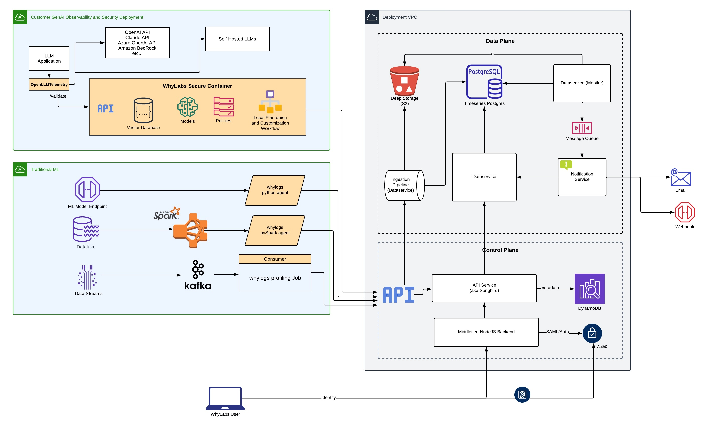

# WhyLabs AI Control Center

This repository contains several the source code of the WhyLabs AI Control Center platform (also known as the"WhyLabs Platform").

## Overview

With the WhyLabs AI Control Center you have tools to observe, monitor, secure, and optimize AI applications. Teams across healthcare, financial services, logistics, e-commerce, and others use the WhyLabs platform to:

* Monitor the performance of predictive ML and generative AI models
* Continuously track ML model performance using built-in or custom performance metrics, with support for delayed ground truth
* Monitor and observe data quality in ML models inputs, feature stores, batch and streaming pipelines
* Detect and root cause common ML issues such as drift, data quality, model performance degradation, and model bias
* Guardrail LLMs with policy rulesets aligned to MITRE ATLAS and LLM OWASP standards using a secure containerized agent, and a proprietary policy manager
* Detect, alert, and control against common LLM issues including toxicity, prompt injections, PII leakage, malicious activity, and hallucinations
* Visualize and debug LLM interactions, including RAG events, using OpenLLMTelemetry
* Identify vulnerabilities and optimize performance via dedicated and customizable dashboards for LLMs traces, security metrics, cost tracking, and model performance
* Improve AI applications through user feedback, monitoring, and cross-team collaboration

## Components

Due to extensiveness of the platform, we have broken down the platform into two major components:
* **[WhyLabs Observe](./observe/README.md)**: WhyLabs Observe provides full AI lifecycle observability for insights into your data and model health, alerting you to drift events, performance degradations, potential attacks, and model behavior changes. WhyLabs Observe processes standardized telemetry signals from the [whylogs](https://github.com/whylabs/whylogs) library and enable production monitoring use cases for ML observability.

* **[WhyLabs Secure](./secure/README.md)**: WhyLabs Secure acts as a robust set of capabilities that provide a shield for your AI, mitigating potential risks like hallucinations, data leakage, misuse, bad user experience, and inappropriate content generation. WhyLabs Secure integrates with the [openllmtelemetry](https://github.com/whylabs/openllmtelemetry) library to collect traces for LLM observability

## Documentation

- [Issue Tracker](https://github.com/whylabs/whylabs-oss/issues)
- [Documentation](https://docs.whylabs.ai)
- [Community Forum](https://whylabs.ai/slack-community)

## Architecture

### Development Setup

Each of the sub-packages have their own requirements to set up and build. Please follow the individual README.md for instructions

## License

The project is licensed under Apache 2.0 license.

**IMPORTANT**:  The following packages legacy-ui, observe/dashboard or secure/app use the [Highcharts](https://www.highcharts.com/) API for rendering data visualizations. The open source packages do not reference Highcharts as a dependency directly due to the restrictive licensing. If you wish to build and run the WhyLabs Platform, you will need to purchase the correct [Highcharts License Type](https://shop.highcharts.com/) for your use case and agree to the Highcharts licensing terms. 
 
---

## FAQs

### Can I use the open source project for commercial purposes?

Yes, you can use the WhyLabs AI Control Center open source project for commercial purposes. The platform is available under the Apache 2.0 license, which means you are free to use and modilfy the platform for your own purposes. Note that the platform have visualization components that depends on Highcharts. If you are using those components you will need to comply with [the Highcharts licensing](https://shop.highcharts.com/#faq) rules.

### Can I contribute to the open source project?

At this time the WhyLabs AI Control Center open source project is not open to contributions from the community. The platform is maintained by the WhyLabs team, and we do not accept contributions from external developers. If you encounter a bug or issue with the platform, please submit an issue on the relevant GitHub repository.

### How do I report a bug or issue with the open source project?

At this time, the WhyLabs team is not able to making changes or updates to the platform source code based on community feedback or requests. However, if you are running the platform on your own infrastructure and encounter a bug or issue, you are free to address and fix them yourself.  

### How do I request a new feature for the open source project?

At this time the WhyLabs team is not accepting feature requests for the open source project. However, if you are running the platform on your own infrastructure you are free to modify the platform to suit your needs. 

For more information, visit [WhyLabs AI Control Center documentation](https://docs.whylabs.ai/).