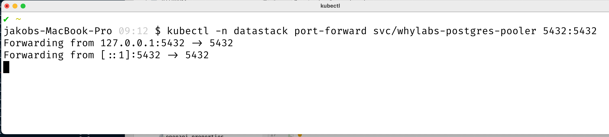
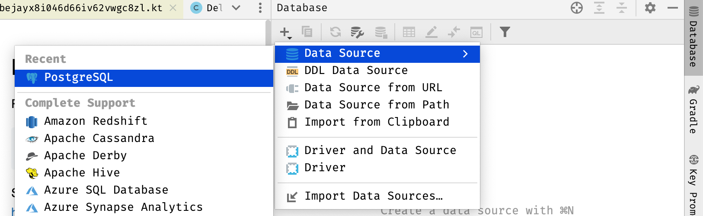
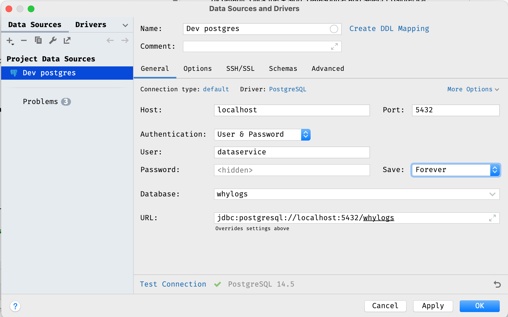
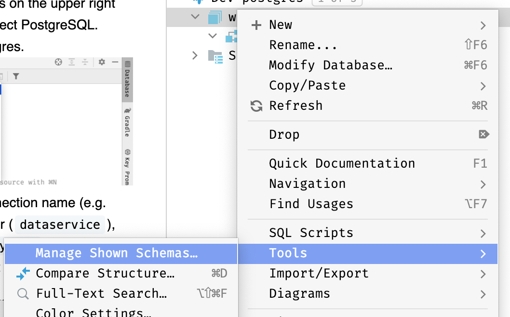
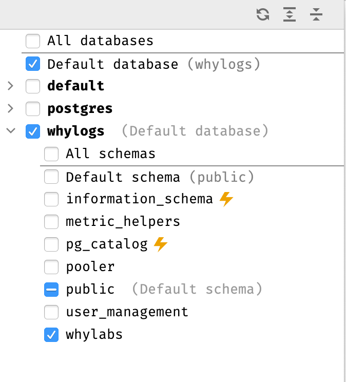
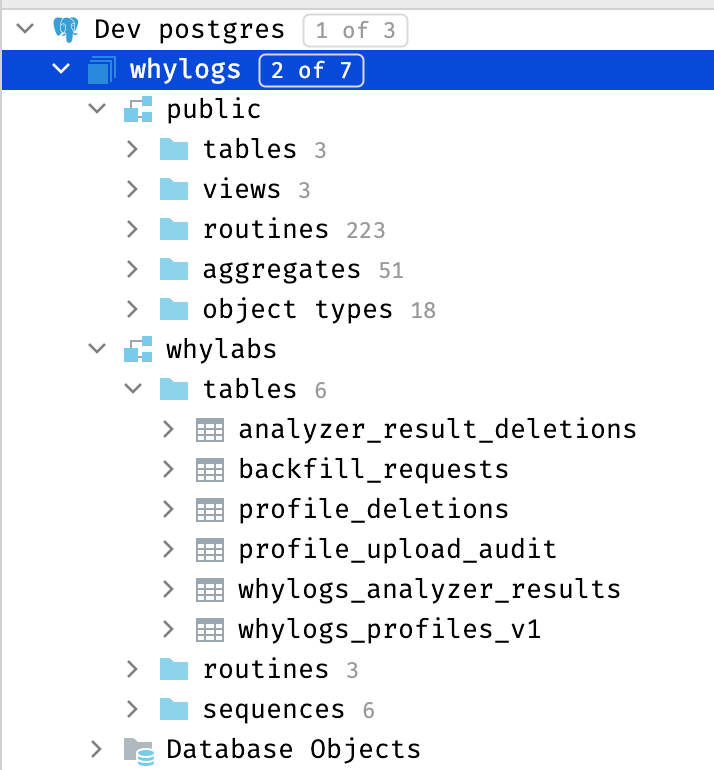
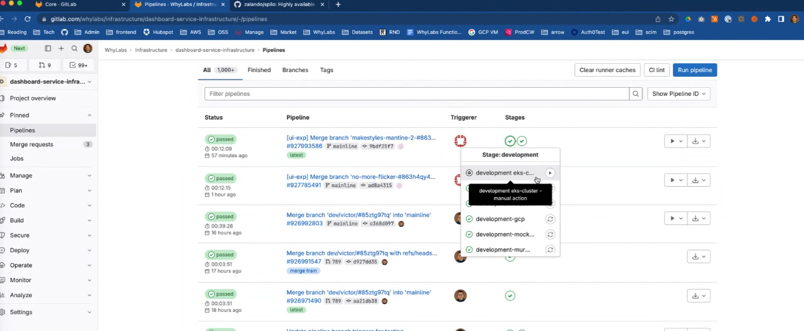
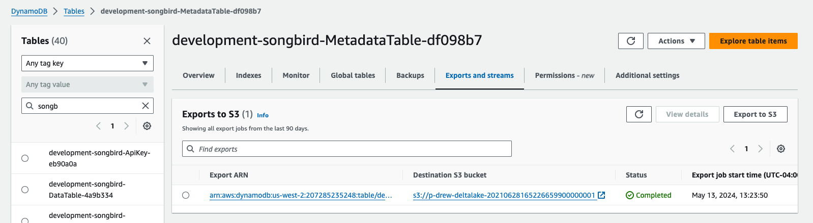

## Development
Run in development mode.

See how to run Postgres locally below.

Alternatively, these values can be picked up through environment variables or in [IntelliJ IDEA](https://www.twilio.com/blog/set-up-env-variables-intellij-idea-java).

## Access PG/Dataservice via tailscale

Alternative to telepresence is tailscale. You can sign up with whylabs.ai email domain via Google login and install tailscale on your machine.
For dev, here are the dev endpoints:
http://dev-songbird/ (http://dev-songbird/swagger-ui/)
http://dev-dataservice/ (http://dev-dataservice/swagger-ui/)
http://dev-arima/ (no idea about Swagger UI)
If you are full time dev, you will be able to access prod endpoints once we roll out the prod version (http://prod-songbird/ is available now FYI).
You won’t need to switch network to connect to prod anymore (for those who has access to prod).

1. dev-postgres-pooler-repl: pooler replica. This is what you need for read-only access
2. dev-postgres-pooler: primary pooler. This gives you read-write access. This is given only to currently Chris, Drew, Andy
3. dev-postgres -> directly connect to primary
4. dev-postgres-repl -> replica load balancer

## Debugging adhoc

When running dataservice connected to a remote database and attempting to run async analysis you might discover you're consuming
from the same work queue as what's deployed and fighting to de-queue. To alleviate this issue simply set an env var
to scope queueing to yourself. 

QUEUE_USER=drew

## How to hotpatch prod

Grab the git sha for whylabs-processing-core you want to deploy and update the appropriate app tier. In this example PR we're hot patching dataservice-monitor.
https://gitlab.com/whylabs/infrastructure/gitops/-/merge_requests/514

## How to modify prod PG EBS storage class

https://gitlab.com/whylabs/infrastructure/dashboard-service-infrastructure/-/merge_requests/1053

## How to spin up a standby cluster
https://gitlab.com/whylabs/sre/-/blob/mainline/runbooks/postgres/create-standby-cluster/README.md?ref_type=heads
https://gitlab.com/whylabs/sre/-/blob/mainline/runbooks/postgres/promote-standby-cluster/README.md?ref_type=heads

## Run config (intellij) connected to dev/prod PG containers 
:data-service:run

MICRONAUT_ENVIRONMENTS=remote;POSTGRES_BULK=dev-postgres-primary-pooler;DISABLE_LIQUIDBASE=true;DB_STANDBY_POOLER_HOST=dev-postgres-monitor-pooler;POSTGRES_HOST=dev-postgres-primary-pooler;DB_USER=dataservice;DB_PASSWORD=*****

vm args
-Ddebug=true -Dlog4j2.configurationFile=/src/main/resources/log4j2.xml

```bash
eval $(cat ./dev.env) ./gradlew -t :data-service:run -t
```

Swagger IO interface:
```bash
open http://localhost:8081/swagger-ui/
=======
http://localhost:8081/swagger-ui/

## Publishing the Node client (manually)

1. Run `gw build`
2. Run `gw generateNodeClient`
3. `cd build/generated/node/`
4. Create a file called `.npmrc` with the following contents:

```text
@whylabs:registry=https://gitlab.com/api/v4/projects/41911239/packages/npm/
//gitlab.com/api/v4/projects/41911239/packages/npm/:_authToken=${NPM_TOKEN}
//gitlab.com/api/v4/packages/npm/:_authToken=${NPM_TOKEN}
```

5. Get a personal access token for GitLab with the `api` scope.
6. Set it to `NPM_TOKEN` env var.
7. Run `npm install && npm run build && npm version patch && npm publish`
8. If you get a 403, you might need to manually adjust the version, so that you don't overwrite an existing one
9. The updated client should now be published here: https://gitlab.com/whylabs/core/data-service-node-client/-/packages

## Connecting to the Dev instance through IntelliJ
First, familiarize yourself with [EKS](https://whylabs.atlassian.net/wiki/spaces/EN/pages/1581580289/EKS+101), AWS' hosted Kubernetes environment.

DB Username: dataservice
DB name: whylogs

1. Obtain the dev Postgres password, which is stored as a Kubernetes secret. This will be used in a later step.
   ```bash
   kubectl -n datastack get secret dataservice.whylabs-postgres.credentials.postgresql.acid.zalan.do -o jsonpath='{.data.password}' | base64 --decode
   ```
2. Set up a tunnel between your local machine and the postgres loadbalancer (PGBouncer):
   ```bash
   kubectl -n datastack port-forward svc/whylabs-postgres-pooler 5432:5432
   ```
3. Obtain postgres hostname for whylabs-postgres-pooler 
   ```bash
    kubectl get svc -n datastack
   ```

   Which should look like:
   
6. In IntelliJ IDEA, open the Database tab, which is on the upper right by default. Click the + symbol, Datasource and select PostgreSQL. IntelliJ may need to download a driver for Postgres.
   
7. In the new connection window, specify the connection name (e.g. `Dev postgres`), the host (`localhost`), user (`dataservice`), password (obtained above), and database (`whylogs`).  IntelliJ will build the connection URL from these.  Click Test Connection to verify everything is working. Click OK.
   
8. IntelliJ does not by default show the `whylabs` schema, so we need to enable it. Right-click on the `whylogs` database, `Tools`, `Manage Shown Schemas`
   
   
   IntelliJ will load the resources under the `whylabs` schema, and they will be available through the database tab:
   

Tip: Did you get an error like this? Add  ?prepareThreshold=0  to the tail end of your connection string.
```
org.postgresql.util.PSQLException: ERROR: prepared statement "S_1" already exists
```

## Run Postgres Locally

### Getting started

We're using `just` as a build helper, install it with:

```bash
> brew install just
```

Install the other preqrequisiting tooling via `just`:

```bash
> just install-tools
```

### Accessing postgres via docker-compose

> **_NOTE:_**  This area is under rapid development and will be less clunky soon.
>
To access our custom postgres through the pgadmin web interface locally,

```bash
> just start-local-test-env
```

Wait a few moments for the services to start, then access the local [pgadmin](http://localhost:5050).  Log in with username `postgres` and password `zalando` and database `postgres`.  Click on the `Database (1) > postgres > Schemas > whylabs` 

Configure run config for data-service/src/main/java/ai/whylabs/dataservice/Application.java
DB_HOST=jdbc:postgresql://localhost:5455/postgres?prepareThreshold=0;DB_PASSWORD=zalando;DB_USER=postgres

## Loading in sample analyzer results (profiles coming soon)
Inside intellij trigger bulk ingestion (hint, there's a green play button when editing the file) 
ingestion-triggers.http

## Refresh the unit-test test containers database snapshot with the latest schema
1. Spin up a fresh docker image for local dev
```
mkdir -p /tmp/dataservice/snapshots/
docker run -p 5455:5432  -v /tmp/dataservice/snapshots/:/efs/parquet/:rw  --name local-postgres139 -e ALLOW_NOSSL=true  -d public.ecr.aws/whylabs-dev/spilo-postgres:loader-dev18
```
2. Spin up dataservice connected localhost. Hint: your env vars for connecting to localhost
```POSTGRES_PORT=5455;postgres.password=zalando;postgres.bulk.url=jdbc:postgresql://localhost:5455/postgres?prepareThreshold=0;postgres.username=postgres;postgres.url=jdbc:postgresql://localhost:5455/postgres?prepareThreshold=0```
3. Log in 
```aws sso login```
4. Run the rest endpoint to load in some sample data from S3 in dev
   ```bootstrap-unit-test-database.http```
   This REST api reads the list of files from 
5. Convert hypertables => normal so pg_dump works (MAKE SURE YOU'RE RUNNING AGAINST LOCALHOST DOCKER AND NOT DEV/PROD)
```src/main/resources/dba_stuff/convert_hypertables_to_normal.sql```
6.Log into PG docker
```
docker ps
docker exec -i -t [image id] bash
```
7. Snapshot
```
su postgres
pg_dump --inserts -F plain -v -t whylabs.profiles_unmerged_hypertable -t whylabs.profiles_segmented_staging -t whylabs.profile_timeseries -t whylabs.profiles_overall_staging -t whylabs.profile_upload_audit -t whylabs.tags -t whylabs.legacy_segments -t whylabs.reference_profiles -t whylabs.profiles_segmented_hypertable -t profiles_overall_hypertable -f /tmp/all.sql --data-only  postgres
mv /tmp/all.sql /efs/parquet/
exit
exit 
mv /tmp/dataservice/snapshots/all.sql /Users/drew/whylabs/whylabs-processing-core5/data-service/src/test/resources/dumps/all.sql
```

## Bulk loading production (init load)

Take a snapshot of the datalakes. Most tables will load up via the kinesis based trigger, but the profiles no. They
use timescaledb cli utilities to trigger ingestion. Look something like this (enumerate the paths and update the jar of course)
```
spark-submit --deploy-mode client --class ai.whylabs.batch.jobs.SnapshotDeltalake s3://whylabs-deployment-us-west-2/drew/murmuration10.jar -sparkMaster yarn -profilesDatalakeV1 s3://deltalake-20210520203743800800000001/v1-profile-datalake/ -profilesDatalakeV1Snapshot s3://deltalake-20210520203743800800000001/druidSnapshot/profiles/v1delta_pg_08/ -analyzerResultsDatalake s3://deltalake-20210520203743800800000001/analyzer-results-v3/ -analyzerResultsSnapshot s3://deltalake-20210520203743800800000001/druidSnapshot/analyzer_results_08/ -analyzerRunsDatalake s3://deltalake-20210520203743800800000001/analyzer-runs/ -analyzerRunsSnapshot s3://deltalake-20210520203743800800000001/druidSnapshot/analyzer_runs_08/ -postgresBulkIngestionTriggerTopic PostgresBulkIngestionTrigger-93eef1b
```
Once complete, check out the error logs. They'll log out the CLI script to kick. You'll need special access
to the prod-k8s-admin role (currently just Andy & Drew) to ssh into a prod database. Log in

```
aws sso login --profile prod-k8s-admin
alias prod-cluster-admin 'AWS_PROFILE=prod-k8s-admin aws eks --region us-west-2 update-kubeconfig --name development-cluster'
AWS_PROFILE=prod-k8s-admin aws eks --region us-west-2 update-kubeconfig --name production-cluster
k9s
```
Check each postgres-[x] server log to find the primary with the lock. It logs it constantly. Shell attach to that one.
Def open a screen session, and then copy/paste the script generated in emr.

```
screen
```

## Connecting via Telepresence https://whytastic.slack.com/archives/C021NPVE08Y/p1684971647711889

Create .aws/config entry

```
[profile no-process]
sso_start_url = https://whylabs.awsapps.com/start#/
sso_region = us-west-2
sso_account_id = 222222222222
sso_role_name = DeveloperFullAccess
region = us-west-2

[profile dev-k8s]
sso_start_url = https://whylabs.awsapps.com/start#/
role_arn=arn:aws:iam::222222222222:role/k8s-developer
source_profile=no-process
sso_region = us-west-2
sso_account_id = 222222222222
region = us-west-2
#credential_process = aws-sso-util credential-process --profile default
```

https://www.getambassador.io/docs/telepresence/latest/install

aws --profile=dev-k8s eks --region us-west-2 update-kubeconfig --name development-cluster
telepresence connect

## Building PG container

https://gitlab.com/whylabs/core/spilo-15/-/tree/main/postgres-appliance

aws ecr-public get-login-password --region us-east-1 | docker login --username AWS --password-stdin public.ecr.aws/q7d3h7a7

docker buildx build --platform linux/amd64,linux/arm64 -t public.ecr.aws/whylabs-dev/spilo-postgres:parquet-multiarch-jan24 . --push

Note: at time of writing the latest whylogs version will be installed on the container at build time

## Deploy an updated PG container

Update the tag (use arm64) to the latest image
https://gitlab.com/whylabs/infrastructure/dashboard-service-infrastructure/-/blob/mainline/packages/eks-cluster/postgres/cluster/base/postgres-cluster.yaml#L33

PG deploys in gitlab are triggered manually via a button in dashboard-infastructure 


## Running patroni commands (eg failover to replica)

Log into K9s and ssh into any of the containers 
patronictl ...

## Tune postgressql.conf 

Those settings are managed here https://gitlab.com/whylabs/infrastructure/dashboard-service-infrastructure/-/blob/mainline/packages/eks-cluster/postgres/cluster/base/postgres-cluster.yaml#L33

## Restore from backup

TLDR; you're having a bad day. Use pulumi to establish a new cluster with a new name and then follow the instructions
for the operator to get data loaded.

https://postgres-operator.readthedocs.io/en/latest/reference/cluster_manifest/#parameters-defining-how-to-clone-the-cluster-from-another-one

## Watch the video where Andy goes through all the K8 stuff

https://drive.google.com/file/d/1HKO7CWPVqv3MI3nkx6ilESrALaZ00V0j/view?pli=1

## Talk to whylogs from PG SQL

CREATE OR REPLACE FUNCTION andy_kll_double_sketch_get_quantiles (sk_data bytea, split_points double precision[])
RETURNS double precision[]
AS $$
if GD.get("ds") is None:
import whylogs_sketching as _ds
GD["ds"] = _ds
ds = GD["ds"]
sk = ds.kll_doubles_sketch.deserialize(sk_data)
return sk.get_quantiles(split_points)
$$ LANGUAGE plpython3u;

-- -- DROP FUNCTION andy_kll_double_sketch_get_quantiles (sk_data bytea, split_points double precision[]);
-- create table kll_sketch_test(sketch kll_double_sketch);

-- -- default k
-- insert into kll_sketch_test
--   select kll_double_sketch_build(value)
--   from (values (1), (2), (3), (4), (5)) as t(value)
-- ;

-- -- k = 20
-- insert into kll_sketch_test
--   select kll_double_sketch_build(value, 20)
--   from (values (6), (7), (8), (9), (10)) as t(value)
-- ;

select andy_kll_double_sketch_get_quantiles(sketch::bytea, array[0, 0.5, 1]) as min_max from kll_sketch_test;

## Purge delete datasets playbook

Deleting old datasets doesn't necessarily delete the underlying data nor will it reclaim disk space from 
postgres. 

1) Dump the songbird metadata table in dynamo out to S3 in the deltalake bucket 
2) Hit the endpoint on the backfill node to purge all datasets passing in the location of the S3 dump. See ### Purge all deleted datasets in example-requests.http for an example.
3) Watch dataservice logs for "purge complete"
4) Run the scripts in repack_tables.sql to actually reclaim the storage in postgres 
5) Check size_of_biggest_relations to ensure index size hasn't gotten out of proportion with the size of the actual data. A concurrent reindex may be needed https://www.postgresql.org/docs/current/sql-reindex.html#SQL-REINDEX-CONCURRENTLY

## Resize PG EBS volumes

https://whylabs.atlassian.net/wiki/spaces/EN/pages/1986822157/Resize+Volumes

## Adjust timescaledb retention policies
https://whylabs.atlassian.net/wiki/spaces/EN/pages/1840807962/PostgreSQL#Timescaledb-Retention-Policy-Timeout